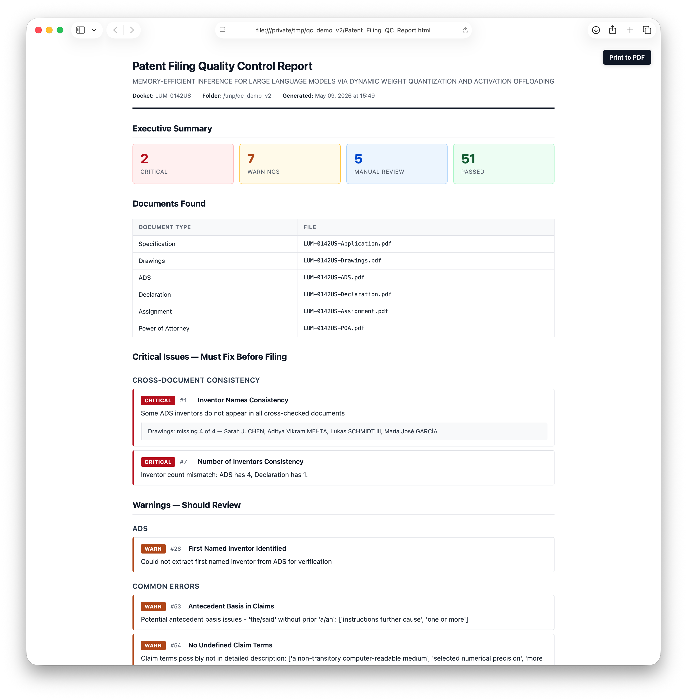

# Patent Filing Quality Control Skill

A comprehensive quality control tool for U.S. patent application filing documents. This Claude Code skill systematically checks for internal document errors, cross-document inconsistencies, USPTO compliance issues, and common filing mistakes before submission to the USPTO.



*Example output (synthetic LLM memory-efficiency filing). The HTML report opens in any browser; the **Print to PDF** button in the upper right calls the browser's print dialog. Each Executive Summary card is a link that jumps to the corresponding section. 2 Critical, 7 Warnings, 5 Manual-Review items, 51 Passes.*

## Overview

Patent applications involve multiple interconnected documents where a single inconsistency—a misspelled inventor name, a mismatched docket number, or an incorrect figure reference—can cause delays, rejections, or legal complications. This skill automates the tedious but critical task of cross-checking all filing documents.

The skill performs **78 automated checks across 16 categories** on all required and optional filing documents, generating a single self-contained HTML report. (Check IDs run 1–85; a few numbers were retired during development, so there are gaps.) To save as PDF, open the HTML in any browser and use File → Print → Save as PDF.

### Reliability foundation

Most regex-based "70-check" patent QC tools produce noise on real filings because PDF text extraction is messy and form-field reading is hard. This skill addresses each of those problems specifically:

- **Direct XFA reading** — the USPTO web-fillable ADS (PTO/AIA/14) is an XFA form that most PDF tools see as a blank "Please wait..." page. The skill parses the embedded XFA datasets XML directly and pulls every field as structured data: inventors with separate first/middle/last/suffix, customer numbers, assignee, drawing-sheet count, signer, continuity entries, etc. No Adobe required.
- **`pdfplumber` for body text** — used as the primary text extractor for spec/declaration/assignment/POA. Preserves paragraph structure and section headers that PyPDF2 strips, which is what the section-detection and claim-parsing checks rely on. It also recovers text from PDFs whose font encodings PyPDF2 cannot decode (a common reason older declarations show up as "unreadable").
- **Content-based file classification** — files are identified by *content* (claim language, declaration boilerplate, XFA element names, FIG. references), not by filename. `Application.pdf`, `Formals.pdf`, `X000-0000US-A.pdf` — any naming convention works.
- **Continuation-aware** — when the ADS XFA shows a `CON`/`DIV`/`CIP` continuity entry, date-logical checks (declaration date, assignment date) accept the parent's older date as expected, and the docket-consistency check only requires Spec↔ADS to match (parent's dec/asgn carry forward different dockets).
- **Image-only-page detection** — when a declaration or assignment has scanned signature pages with no extractable text, cross-document inventor checks hedge their findings ("missing inventor may be on the image-only page; verify manually") rather than firing a false-positive CRITICAL.
- **Multi-docket extraction** — patent filings often carry both a Client Docket and an Attorney Docket. The cross-docket consistency check looks for ANY docket overlap, not strict equality.

## Supported Documents

| Document | Required at filing? | Description |
|----------|---------------------|-------------|
| Specification | Yes | The patent application text including claims |
| Drawings | Yes | Figures and illustrations |
| Application Data Sheet (ADS) | Yes | Bibliographic information |
| Declaration | **Eligible for missing-parts** | Inventor oath/declaration. Required for the application to be examined, but the filing can be submitted without it under 37 CFR §1.53(f) — the USPTO will issue a Notice to File Missing Parts, and the declaration must then be filed within 2 months along with the §1.16(f) surcharge. The QC tool detects this case and asks whether the omission is intentional rather than failing the filing outright. |
| Assignment | No | Transfer of rights to assignee |
| Power of Attorney | No | Authorization for practitioners |

**Filenames don't matter.** The script identifies each file by inspecting its *content* (claim language, declaration boilerplate, XFA form streams, FIG. references, etc.), not by matching filenames against a fixed pattern list. A specification named `Application.pdf`, a declaration named `Formals.pdf`, an ADS named `X000-0000US-A.pdf` — any naming convention works. XFA forms (PTO/AIA/01, /02, /14, /82, etc.) are distinguished from one another by inspecting their embedded XML.

**Specs can be `.docx` or `.pdf`.** The USPTO accepts the specification in Word format, and the tool reads `.docx` files via python-docx and routes them to the Specification slot the same way it routes PDFs. Other filing documents (declaration, ADS, drawings, assignment, POA) should be PDFs.

## Installation

**You don't need to install anything by hand.** Just install the skill (drop it in `~/.claude/skills/patent-filing-qc/` or symlink it from a project) and run it. The first time you ask Claude to QC a filing, Claude will detect any missing dependencies, install them automatically (asking your permission once per package), and proceed. The reference below is provided for users who prefer to set things up themselves.

### What gets installed (and why)

| Package | When needed | Install command |
|---------|-------------|-----------------|
| **PyPDF2** | Always — used for XFA stream extraction and AcroForm inspection | `pip install PyPDF2` |
| **pdfplumber** | Always — primary text extractor for spec/declaration/assignment/POA. Preserves paragraph structure PyPDF2 strips, which the spec-content checks need to work correctly. | `pip install pdfplumber` |
| **python-docx** *(optional, for Word specs)* | Only if a `.docx` file is in the folder. The USPTO accepts the specification in `.docx`; this lets the tool read it. | `pip install python-docx` |
| **pytesseract + pdf2image** *(optional OCR)* | Only for scanned/image-based filing documents that aren't text-searchable. **Not needed for the USPTO XFA-based ADS** — that's handled by the built-in XFA reader. | `pip install pytesseract pdf2image` + `brew install tesseract poppler` |

To install everything in one step, use the bundled requirements file:

```bash
pip install -r requirements.txt
```

The report is generated as a self-contained HTML file with embedded CSS — no external tooling (no pandoc, no LaTeX, no weasyprint) is required. To save the report as a PDF, open the HTML in any browser and use **File → Print → Save as PDF**. The output is identical on every operating system.

### Recommended: Reduce Permission Prompts in Claude Code

By default Claude Code asks for permission on every Bash call, every PDF read, and every report write — running this skill on a real filing can trigger 50–100+ permission popups. To eliminate that without using `--dangerously-skip-permissions`, add the following to your `~/.claude/settings.json` (or your project's `.claude/settings.json`):

```json
{
  "permissions": {
    "allow": [
      "Bash(python3 *qc_patent_filing.py*)",
      "Bash(pip install PyPDF2*)",
      "Bash(pip install pdfplumber*)",
      "Bash(pip install python-docx*)",
      "Bash(pip install pytesseract*)",
      "Bash(pip install pdf2image*)",
      "Bash(pdftotext *)",
      "Bash(pdfinfo *)",
      "Read(*.pdf)",
      "Write(*Patent_Filing_QC_Report*)"
    ]
  }
}
```

These rules cover the script invocation, dependency installs, the PDF reads the script performs, and the report file written to the filing folder. After adding them, a typical run will produce only a handful of permission prompts (or none, if everything is allowlisted).

## Usage

### Basic Usage

```bash
python3 scripts/qc_patent_filing.py /path/to/filing/documents
```

### With Custom Output Directory

```bash
python3 scripts/qc_patent_filing.py /path/to/filing/documents --output-dir /path/to/reports
```

### Lightweight (Filing-Identity-Only) Mode

Skips drafting-quality checks (antecedent basis, terminology consistency,
abstract length, optional USPTO formatting, etc.) and reports only the checks
that catch a **wrong or mismatched file** at filing time — cross-document
consistency, document completeness, drawings margin labels, figure/claim
counts, placeholder text, and dates. Use when the specification has already
been drafting-reviewed.

```bash
python3 scripts/qc_patent_filing.py /path/to/filing/documents --lightweight
```

### Optional: Authoritative Inventor List

If you drop any of these files into the filing folder, the script will use them as the canonical source of inventor names and run an additional cross-check (Check 71) against ADS / declaration / assignment / drawings:

| File | Format |
|------|--------|
| `inventors.json` | JSON array of `{"first", "middle", "last", "suffix"}` objects, or array of full-name strings |
| `inventors.txt`  | One inventor per line — `First Middle Last [Suffix]` or `Last, First M., Suffix` |
| `*.eml`          | Email file(s); names are extracted from the body on a best-effort basis |

This is useful for catching the case where a paralegal confirmed an inventor name in an email and the ADS form was filled in with a typo or missing middle name / suffix. Diacritic differences (e.g., `José` vs `Jose`, `Müller` vs `Muller`) are matched as equivalent so they don't cause false-positive failures.

Example `inventors.txt`:

```
Dharani Bharathi Thirupathi
Veerajothi Ramasamy
Sriram Santhanam
Smith, John P., Jr.
```

### Output

The script generates one report file:
- `Patent_Filing_QC_Report.html` — self-contained HTML with embedded CSS. Opens in any browser. The visual layout is deterministic regardless of operating system or installed software.

If you want a paper copy, open the HTML in a browser and use File → Print → Save as PDF. Browser-rendered PDFs are visually identical across Chrome, Safari, Firefox, and Edge.

## Quality Control Checks

Each check produces CRITICAL / WARN / INFO / PASS. Checks marked **†** are
*drafting-quality* checks that `--lightweight` (filing-identity-only) mode
skips; everything else runs in both modes.

### 1. Cross-Document Consistency (8 checks + 1 conditional)

Ensures information matches across all documents:

| # | Check | Description |
|---|-------|-------------|
| 1 | Inventor Names Consistency | Each ADS inventor's name (surname or full) appears in the declaration and assignment. SKIPPED entries list which sources were excluded; findings hedge to WARN when a document has image-only (scanned) pages. |
| 2 | Application Title Consistency | ADS title appears in the specification |
| 3 | Attorney Docket Number Consistency | Docket number matches across documents (Spec ↔ ADS for continuations) |
| 4 | Correspondence Address Consistency | Address aligns between ADS and other documents |
| 5 | Assignee Name Consistency | Assignee name is consistent where referenced |
| 6 | Filing Date Consistency | Dates are logically consistent (no future dates, proper sequence) |
| 7 | Number of Inventors Consistency | Inventor count matches across documents |
| 8 | Inventor Citizenship/Residency Consistency | Residency populated for each inventor (XFA structured field) |
| 71 | **Inventor Names vs. Authoritative Source** *(conditional)* | If `inventors.txt`, `inventors.json`, or `*.eml` is present, all documents are cross-checked against that list. Diacritic-tolerant matching. |

### 2. Document Completeness (6 checks)

Verifies all required components are present and the folder is clean:

| # | Check | Description |
|---|-------|-------------|
| 9 | All Required Documents Present | Specification, drawings, ADS, and declaration all exist (declaration eligible for missing-parts, below) |
| 10 | ADS Required Fields Complete | All mandatory ADS fields are completed |
| 11 | Declaration Signatures Present | Declaration carries inventor signatures (`/Name/` or `/s/`), not just form labels |
| 12 | Assignment Signatures Present | Assignment carries assignor signatures |
| 74 | Duplicate Files for Same Document Type | Warns when two files classify as the same document type |
| 75 | Unrecognized Files in Folder | Surfaces files that didn't classify, so nothing is silently ignored |

**Missing-Parts Filings (37 CFR §1.53(f)):** If the Declaration is the only thing missing, the tool flags it as a CRITICAL with `ACTION REQUIRED: confirm whether intentional`. Claude will ask you whether you're filing without the declaration on purpose. If yes, the issue is downgraded to a warning and you're reminded that:

- A **§1.16(f) surcharge fee** is due at or after filing
- The missing parts must be filed within **2 months** of the USPTO's Notice to File Missing Parts to avoid abandonment

Missing Specification, Drawings, or ADS are *not* eligible for missing-parts treatment and remain CRITICAL.

### 3. Specification-Specific (9 checks)

Validates the patent specification document:

| # | Check | Description |
|---|-------|-------------|
| 13 | Claim Numbering Sequential | Claims are numbered 1, 2, 3… without gaps (recovers numbers merged with page footers) |
| 14 | Claim Dependency Validity | Dependent claims reference existing claims |
| 15 | Figure Reference Validity | FIG. references in the spec resolve in the drawings |
| 16 † | Reference Numeral Consistency | Reference numerals used consistently |
| 17 † | Abstract Present and Length Compliant | Abstract exists and is ≤ 150 words |
| 18 † | Background Section Present | Background section detected |
| 19 † | Brief Description of Drawings Present | Brief-description section detected |
| 20 † | Detailed Description Present | Detailed-description section detected |
| 21 | Claims Section Present | Claims section is present |

### 4. Drawings-Specific (4 checks)

Validates the drawings/figures:

| # | Check | Description |
|---|-------|-------------|
| 22 | Figure Numbering Sequential | Figures are numbered FIG. 1, FIG. 2… without gaps |
| 23 | Drawing Margin Labels | Drawings carry the **title and docket number** in the margin — the strongest single "wrong file attached" identity check |
| 24 † | Sheet Numbering Present | Sheets carry X/Y numbering |
| 25 † | No Color Drawings | Flags color drawings (which need a petition) |

Image-only (scanned) drawings degrade gracefully to INFO rather than firing false CRITICALs.

### 5. ADS-Specific (4 checks + 1 conditional)

Validates the Application Data Sheet:

| # | Check | Description |
|---|-------|-------------|
| 27 | Inventor Addresses Complete | Full mailing address for each inventor |
| 28 | First Named Inventor Identified | First inventor matches between ADS and POA |
| 29 | Entity Status Specified | Small/micro/large entity status is specified |
| 31 | Attorney/Agent Information | Registration numbers / customer number present |
| 73 | **Attorney vs. Correspondence Customer Number** *(XFA only)* | The two customer-number fields in the ADS usually match; warns on mismatch |

When the ADS is read via XFA, the report also includes an **"ADS Data Summary (Extracted from XFA)"** table near the end showing all extracted fields (title, docket #, entity status, both customer numbers, assignee + address, drawing sheet count, representative figure, domestic continuity, foreign priority, non-publication request, AIA transition statement, signer, registration number, signature date, form pages) plus an inventor table with name / residency / city / country / citizenship.

### 6. Declaration-Specific (4 checks)

Validates the inventor declaration:

| # | Check | Description |
|---|-------|-------------|
| 32 | All Inventors Named in Declaration | Every ADS inventor appears on the declaration |
| 33 | Oath vs Declaration Format | Recognized declaration/oath format |
| 34 | Declaration References Correct Application | References the correct application/docket |
| 35 | Declaration Date Logical | Execution date is logical (not future; continuation-aware) |

### 7. Assignment-Specific (5 checks)

Validates the assignment document (if present):

| # | Check | Description |
|---|-------|-------------|
| 36 | Assignment Identifies All Assignors | All inventors listed as assignors |
| 37 | Assignment Identifies Assignee | Assignee entity is clearly identified |
| 38 | Assignment References Correct Application | References correct application/docket number |
| 39 | Assignment Execution Date Logical | Date is logical and properly formatted |
| 40 | Assignment Covers Correct Rights | Proper rights-transfer language present |

### 8. Power of Attorney-Specific (3 checks)

Validates the POA document (if present):

| # | Check | Description |
|---|-------|-------------|
| 41 | POA Names All Practitioners | Practitioners / customer number identified |
| 42 | POA Includes Registration Numbers | USPTO registration numbers present |
| 44 | POA Properly Signed | Signature present (`/Name/` or `/s/`), hedged for image-only pages |

### 9. USPTO Formatting Compliance (2 checks)

| # | Check | Description |
|---|-------|-------------|
| 45 † | Specification Line Numbering | Notes presence/absence of line numbering (informational) |
| 49 † | Page Numbering Present | Notes presence/absence of page numbering (INFO for `.docx` specs) |

### 10. Common Error Detection (5 checks)

Catches frequent mistakes:

| # | Check | Description |
|---|-------|-------------|
| 50 | No Placeholder Text Remaining | No [INSERT], TODO, XXX, TBD, or similar placeholders |
| 51 | No Track Changes or Comments Visible | No visible revision marks or comments |
| 52 † | Consistent Use of Claim Terminology | Same terms used consistently in claims |
| 53 † | Antecedent Basis in Claims | "Said"/"the" terms have a prior antecedent |
| 54 † | No Undefined Claim Terms | Claim terms appear in the specification |

### 11. File Quality (4 checks)

Validates PDF file properties:

| # | Check | Description |
|---|-------|-------------|
| 55 | PDF Text-Searchable | PDFs contain extractable text (not just images) |
| 56 | File Naming Conventions | Notes file-naming consistency (informational) |
| 57 | No Password Protection | PDFs are not password protected |
| 58 | File Size Reasonable | Files are not zero-byte or suspiciously large/small |

### 12. Cross-Reference Validation (4 checks)

Ensures internal references are valid:

| # | Check | Description |
|---|-------|-------------|
| 59 † | Claims Reference Specification Elements | Claim elements appear in specification |
| 60 † | Specification Summary Matches Claims | Summary scope aligns with claims |
| 61 | Drawing Figure Count Matches Specification | Number of figures matches references |
| 62 | Claim Count Verification | Claim count matches across documents |

### 13. Priority / Related Applications (4 checks)

Validates priority claims:

| # | Check | Description |
|---|-------|-------------|
| 63 | Priority Claim Consistency | Priority info matches between spec and ADS |
| 64 | Related Application References | Related apps referenced consistently |
| 65 | Foreign Priority Documents | Foreign priority documented |
| 81 | Priority Application Number Verification | Spec ↔ ADS application-number consistency (catches digit errors). When `USPTO_ODP_API_KEY` is set, additionally verifies each number's existence and filing date against USPTO public records; otherwise emits manual Patent Center / Google Patents verification links |

### 14. Final Quality (4 checks)

Final review checks:

| # | Check | Description |
|---|-------|-------------|
| 66 † | No Obvious Typos in Critical Fields | Critical fields free of obvious typos |
| 67 | Dates in Proper Format | All dates in a recognized format |
| 68 † | No Excessively Long Claims | Flags very long claims (readability) |
| 70 † | Consistent Figure Reference Format | Consistent FIG. vs Figure usage |

*(Check 69 "Specification References All Claims" was removed — its premise was
wrong, as US claims carry no reference numerals; claim-element → specification
support is already covered by Check 59.)*

### 15. Information Disclosure Statement / IDS (5 checks)

IDS is optional under MPEP 609; this group emits a single PASS when no IDS is present, and otherwise sanity-checks the form:

| # | Check | Description |
|---|-------|-------------|
| 76 | IDS Documents Present | Recognizes an IDS form and/or PTO/SB/08c written assertion |
| 77 | IDS Form Signed | Practitioner signature and registration number present |
| 78 | IDS Reference Counts | Counts cited US patents / publications / foreign documents / NPL |
| 79 | Written Assertion Selection Made | Exactly one §1.17(v) checkbox is selected (CRITICAL if zero or more than one) |
| 80 | Written Assertion Signed | Written assertion carries a signature |

### 16. Sequence Listing (4 checks)

Gated to biological applications — emits a single PASS for everything else:

| # | Check | Description |
|---|-------|-------------|
| 82 | Sequence Listing Present | CRITICAL when the spec uses "SEQ ID NO" but no listing file is in the folder |
| 83 | Sequence Listing Format | Requires WIPO ST.26 XML; CRITICAL for legacy ST.25 `.txt` or malformed XML |
| 84 | Sequence Listing Internal Consistency | ST.26 title / docket / declared-vs-actual sequence count vs the filing package |
| 85 | Biological Sequence Detection | Flags inline sequences at/above the listing threshold that lack a "SEQ ID NO" label |

## Report Severity Levels

Each check produces one of these results, shown as a colored badge in the HTML report:

| Level | Badge color | Meaning |
|-------|-------------|---------|
| **CRITICAL** | red | Must fix before filing |
| **WARN** | amber | Potential issue, review recommended |
| **INFO** | blue | Informational / manual review recommended (e.g., when extraction couldn't fully verify the check) |
| **PASS** | green | Check passed, no action needed |
| **N/A** | gray | Check skipped / not applicable (optional document absent or precondition unmet — e.g. no IDS, no foreign priority, non-biological application). Separate from PASS so the Pass count reflects only checks that verified something. |

## Known Limitations

### PDF Text Extraction
PDF text extraction can sometimes merge words across line breaks. The tool is designed to avoid false positives from extraction artifacts, but some edge cases may occur.

### Patent Drafting Conventions
The tool recognizes common patent drafting conventions (e.g., sentences beginning with subordinate conjunctions) and avoids flagging these as errors.

### Form Field Reading
When reading fillable forms (like ADS), form field boundaries can affect text extraction. The tool cross-references multiple documents to avoid false positives.

### XFA-Based ADS Forms (USPTO PTO/AIA/14)
The USPTO web-fillable ADS is an XFA (Adobe LiveCycle) form. PyPDF2 and most PDF tools see only a "Please wait..." placeholder page when opening these forms — the actual filled-in data is stored in an embedded XML stream. **This script reads that XML stream directly**, so:

- ✅ No Adobe Acrobat Pro flattening is required
- ✅ No "Print to PDF" workaround needed
- ✅ Inventor first / middle / last names and the explicit suffix field (Jr., III, etc.) are read as separate structured values — far more reliable than regex extraction from OCR'd text, especially for foreign names with diacritics
- ✅ Works on any platform (no Adobe software needed at all)

When the script detects an XFA-based ADS, the console will show `✅ XFA extraction successful` and the cross-document checks will use the structured XFA data preferentially.

### What This Tool Cannot Do
- Replace human judgment on legal/technical issues
- Evaluate claim scope adequacy
- Assess patentability
- Verify technical accuracy of the invention description

## Best Practices

1. **Run QC multiple times** - After each round of fixes, re-run to catch new issues
2. **Don't ignore INFO items** - These require manual verification
3. **Fix critical issues first** - These will cause filing rejections
4. **Investigate warnings** - May be false positives, but often indicate real problems
5. **Archive the report** - Save the HTML report (or its print-to-PDF rendering) with the filing records
6. **Human review is essential** - Automated checks supplement but don't replace attorney review

## Development

The repository ships a self-contained regression suite that drives the checks
against in-memory fixtures (no real PDFs, no network), plus continuous
integration that runs it on every pull request.

```bash
python3 tests/test_qc_patent_filing.py
```

The suite is location-independent and exits non-zero on any failure. CI
(`.github/workflows/tests.yml`) runs it on every PR and on pushes to `main`, so
a change that breaks or deletes a check is caught before merge. See
`tests/README.md` for what's covered.

## File Structure

```
patent-filing-qc/
├── SKILL.md                      # Claude Code skill definition
├── README.md                     # This file
├── LICENSE                       # MIT
├── requirements.txt              # Python dependencies
├── docs/
│   └── example-report.png        # Screenshot used in this README
├── scripts/
│   └── qc_patent_filing.py       # Main QC script
├── tests/
│   ├── test_qc_patent_filing.py  # Regression suite
│   └── README.md                 # What the suite covers
└── .github/
    └── workflows/
        └── tests.yml             # CI: runs the suite on every PR
```

## License

MIT License — see `LICENSE` file (or [the standard MIT license text](https://opensource.org/licenses/MIT)). Copyright © Leonard Hope.
